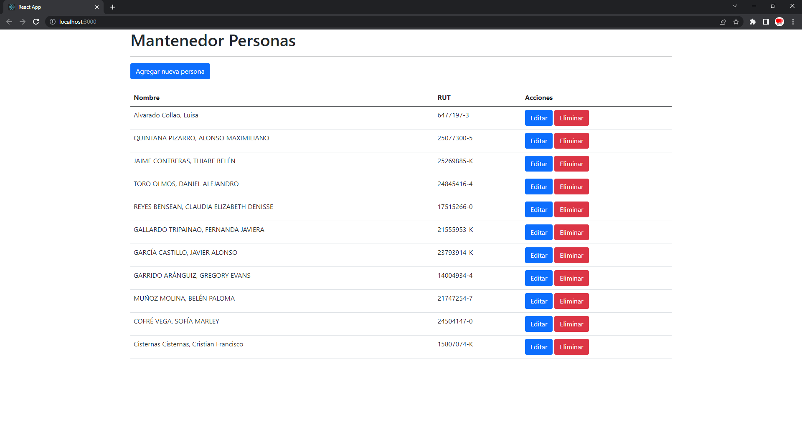

# Mantenedor de Personas - APP

Código fuente de la aplicación que utiliza la API Mantenedor

## Instrucciones para levantar el ambiente de desarrollo

### Pre requisitos

* Tener desplegada la API **"Mantenedor de Personas - API"**, cuyo código fuente está disponible [aquí](https://github.com/flakorules/cfcs-mantenedor-personas-apihttps:/)

### Paso a paso

1. Descargar el codigo fuente utilizando el siguiente comando.

   ```
   git clone https://github.com/flakorules/cfcs-mantenedor-personas-app.git
   ```
2. Crear archivo .env con el siguiente contenido en directorio **"\src"**, reemplazando **"URL MANTENEDOR DE PERSONAS API"** por la URL donde disponibilizaste la API **"Mantenedor de Personas - API"**:

   ```
     REACT_APP_BASE_URL=https://<URL MANTENEDOR DE PERSONAS API>/api
   ```
3. Ejecutar el siguiente comando desde directorio **"\src"** para restaurar las dependencias del proyecto.

   ```
   npm install
   ```
4. Ejecutar el siguiente comando desde directorio **"\src"** para levantar la aplicación en modo de desarrollo.

   ```
   npm run start
   ```

   
